<div align="center">

# Oddments
### *A Digital Cabinet of Curiosities*

A personal scrapbook app for collecting, curating, and rediscovering the small, strange, memorable things in life — train tickets, overheard quotes, shells from a foggy beach, songs found at a Sunday market.

**[→ Live Demo](https://oddments.vercel.app)**

<br/>

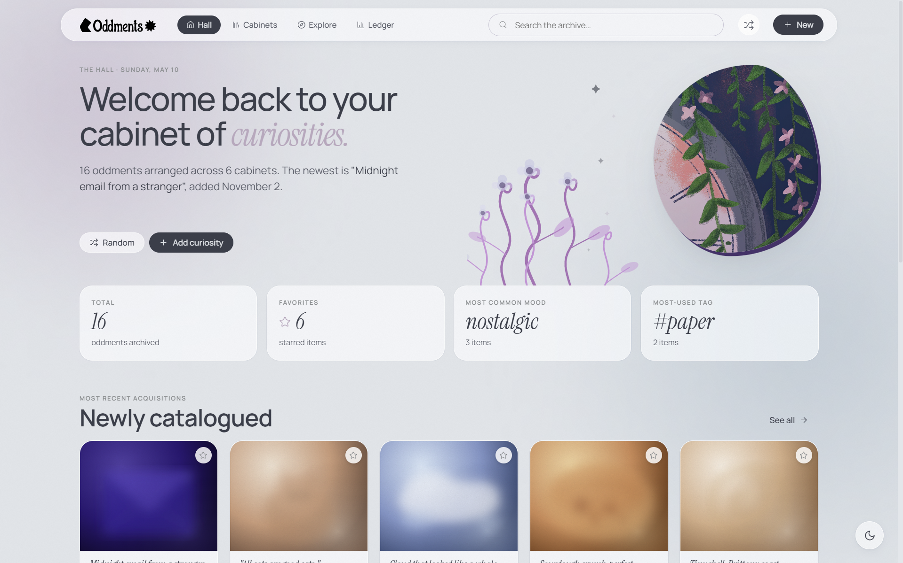

</div>

---

## Overview

Oddments is a single-page web app built with React. It lets you catalogue personal *curiosities* — objects, memories, quotes, music, places, anything worth keeping — organise them into named cabinets, tag and filter them, and explore your archive at a glance.

Everything is saved locally in the browser via `localStorage`. No account, no server, no setup.

---

## Requirements

| Requirement | How it's met |
|---|---|
| Entities that can be added / removed / liked / filtered | **Curiosities** — seed items, fully CRUD with favourite toggle and multi-filter explore view |
| Custom theme / style | Some themes via CSS custom properties (Velvet Archive, Soft Relics, Aurora) |
| Light & dark version | Every theme ships a light and dark variant; toggled with a fixed button |
| Accessible via public link | Static HTML — no build step; deployable to GitHub Pages / Netlify in one click |
| Front-end framework | React 18 (CDN, no bundler needed) |
| Runtime + browser state | React state for all UI; `localStorage` persists curiosities, collections, sort, and view preference |

---

## Features

### Curiosities — the core entity

Each curiosity has a **title**, **description**, **image**, **mood**, **category**, **tags**, and belongs to a **cabinet**. You can:

- **Add** a new curiosity via the `+` button or navbar
- **Edit** any field in-place through the same modal
- **Delete** with a confirmation prompt
- **Duplicate** any item (useful for variations)
- **Favourite** with one click — starred items surface in the dashboard

<br/>

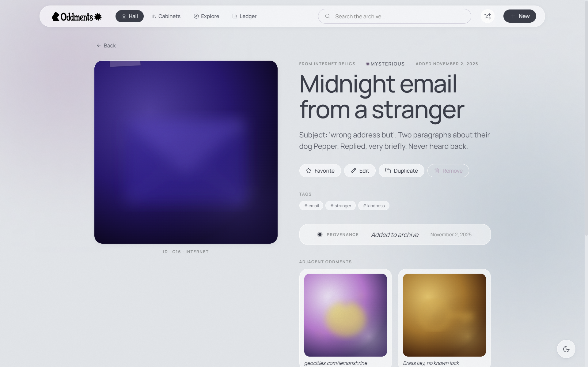
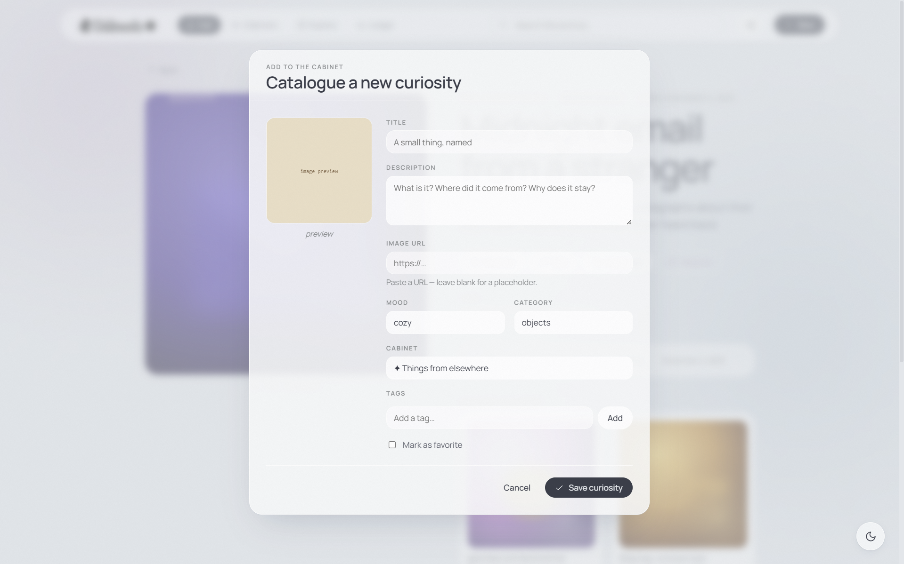

---

### Explore — search, filter, and sort

The Explore page gives full control over the archive:

- **Free-text search** across title, description, and tags
- **Mood filter** — nostalgic, cozy, dreamy, melancholic, chaotic, mysterious, tender
- **Category filter** — objects, memories, quotes, music, places, internet, photos
- **Tag cloud** — click any tag to filter instantly
- **Favourites-only** toggle
- **Sort** by newest, oldest, or title A→Z
- **Three view modes** — grid, shelf, and list

<br/>

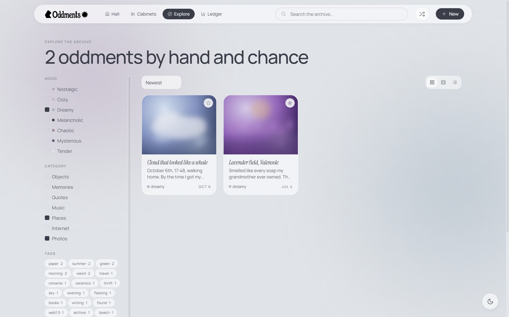
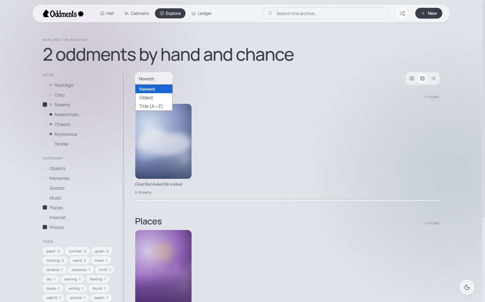
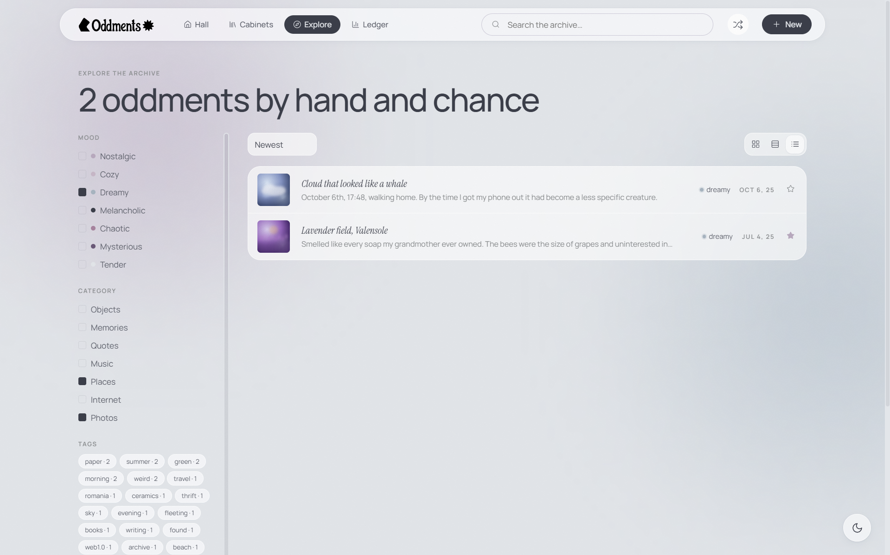
---

### Collections / Cabinets

Group curiosities into named cabinets with a custom colour, emoji, and note. Pin your favourites to the dashboard. Cabinets can be created, edited, deleted, and browsed individually.

<br/>

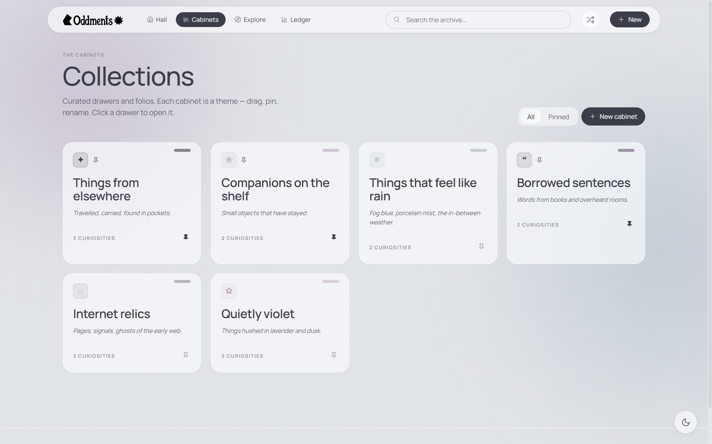
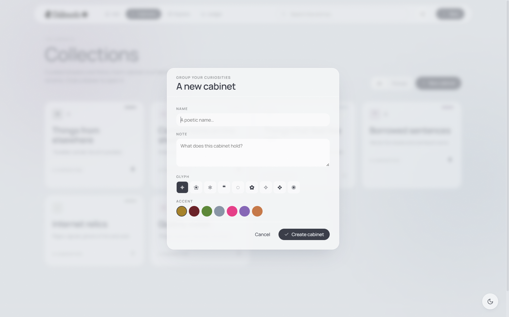

---

### Dashboard

A at-a-glance home view showing:
- Recently added curiosities
- Starred favourites
- Pinned cabinets
- Top mood and tag at a glance
- "Collection of the week" — pseudo-random, stable per week

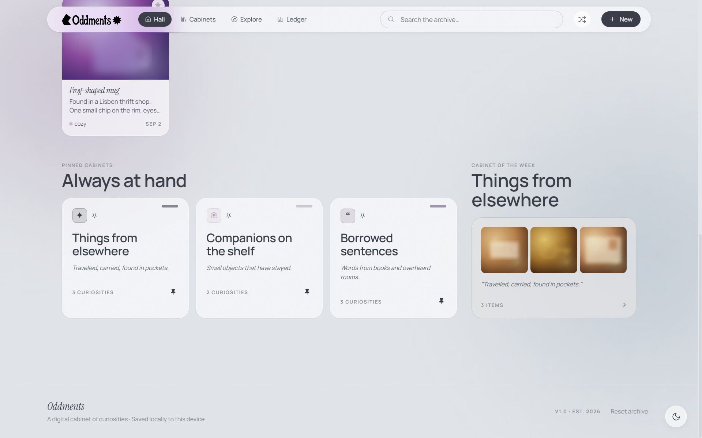

---

### Light & Dark mode

A fixed toggle button (bottom-right) switches between light and dark for the active theme. The preference is applied immediately via `data-mode` on `<body>`.

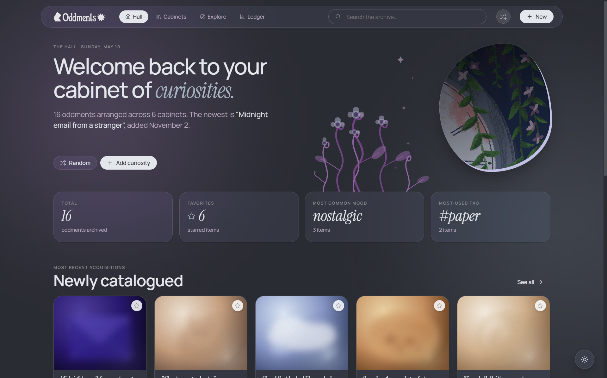
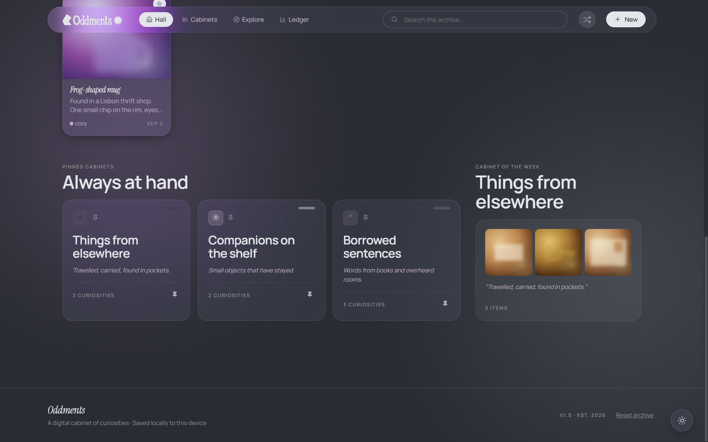

---

## Tech stack

| Layer | Choice |
|---|---|
| UI framework | React 18 (UMD CDN, no bundler) |
| JSX transform | Babel Standalone 7.29 |
| Icons | Lucide 0.469 |
| Type | Instrument Serif, EB Garamond, Caveat, JetBrains Mono, Manrope (Google Fonts) |
| State | React `useState` / `useMemo` + `localStorage` |
| Styling | Vanilla CSS with custom properties, no framework |

---

## Running locally

No install, no build step.

```
git clone <repo-url>
open index.html
```

Or serve it:

```
npx serve .
```

---

## File structure

```
oddments/
├── index.html          # entry point + all CSS (themes, layout, utilities)
├── app.jsx             # root component, routing, keyboard shortcuts
├── store.jsx           # useStore hook — runtime state + localStorage sync
├── seed.js             # 16 seed curiosities and 6 seed collections
├── ui.jsx              # shared components (Button, Card, Modal, Tag, …)
├── icons.jsx           # Icon wrapper around Lucide
├── pages-main.jsx      # Dashboard, CollectionsPage, CollectionDetail, StatsPage
├── pages-explore.jsx   # ExplorePage + filter sidebar
├── pages-modals.jsx    # AddCuriosityModal, CollectionModal, CuriosityDetail
├── tweaks-panel.jsx    # TweaksPanel shell + form controls (useTweaks hook)
└── assets/             # SVG logo, decorative images
```

---

<div align="center">
<sub>Built for the Web Applications course · 2026</sub>
</div>
